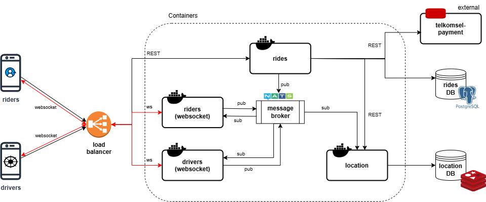
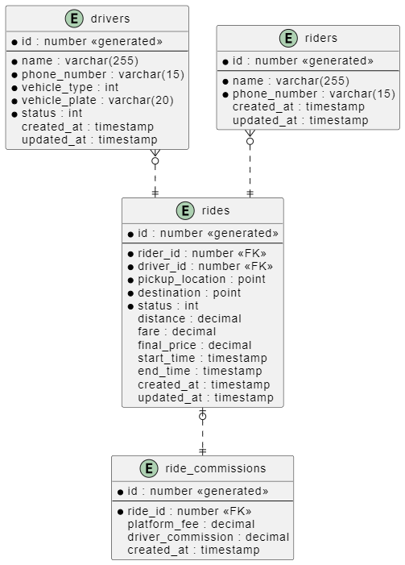
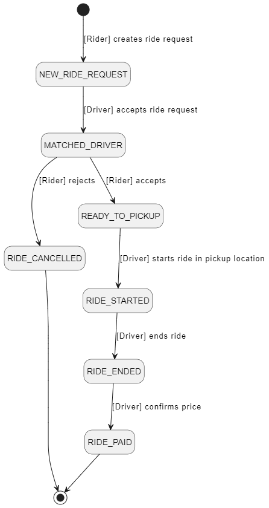

# NebengJek


## Description
NebengJek is a ride-sharing app that connects users with shared rides. Users can either be Riders, requesting a ride, or Drivers, offering their vehicle. Both can choose whom to ride with, as long as they're within a specific area. 🚀

## Main Features
1. __Ride Matching__

    Riders can request a ride to nearest available drivers (in radius 1 km). Drivers can accept or ignore requests. Riders can also be selective on who offered the ride.
2. __Real-Time Location Tracking__

    Once the ride is matched and rider got picked up, driver could start the ride. Both users sending location updates every minute. The app tracks and calculates the distance traveled.
3. __Ride Commissions__
    
    The app takes 30% commission from each ride to support the service maintenance and growth. :)

## Architecture


This system contains of four internal services and one external service (mocked).

1. Riders, responsible for maintaining Riders' connection for real-time location update and ride update broadcast
2. Drivers, responsible for maintaining Drivers' connection for real-time location update and new ride broadcast
3. Rides, responsible for managing Ride data, including driver-rider assignments and ride status lifecycle
4. Location, responsible for managing users' real time locations
5. (External) Tsel-payment service, responsible for maintaining users' credits (mocked)

### Technologies Used ###
**Communication Protocols**
- Websocket, for real-time communication between users and our services, to broadcast ride event changes and real-time location tracking.
- REST API, for stateless ride data updates.
- NATS protocol, for event-driven communication between services. We are using NATS JetStream message broker.

**Databases**
- Postgres, relational database for storing rides detail, drivers, riders, and ride commissions .
- Redis, key-value storage for location data, with built-in geo-location operations for location indexing and nearest distance searching.

**High Availability Tools**
- Load Balancer, distributes user traffic to ensure no single server is overloaded.
- Multi-Availability Zone (Multi-AZ) cloud service, where cloud resources are distributed to more than one area in a cloud region, for data backup and recovery

## Data Schema
The data consists of four tables
1. Drivers: Store driver identity and availability status
2. Riders: Store rider identity
3. Rides: Store ride data (rider id and driver id matches, ride details, status)
4. RideCommissions: Store platform and driver commissions at the end of the ride



### Enumerations
__Ride Status__



__Driver Status__
| Number | Status    | Description 	                        |
|----	 |--------   |-------------	                        |
| 0 	 | OFF       | Driver is not accepting ride request |
| 1  	 | AVAILABLE | Driver turns on the beacon           |


## Data Migration
### Prerequisites
1. Postgres 16
2. [DBMate](https://github.com/amacneil/dbmate), data migration script to initialize tables and data seeds

### Steps
Ensure that your database is running. To Initialize schema and add migration:

```
dbmate --url 'postgres://YOUR_USERNAME:YOUR_PASSWORD@DB_HOST:5436/rides_db?sslmode=disable' up
```

## How to Run
### Prerequisites
1. **Golang >=1.22**, serves web API
2. **Postgres 16**, for ride data store
3. **Redis**, for GeoLocation data store
4. **NATS JetStream**, message broker for event streaming and queue group
5. **Docker**, to encapsulate applications and their dependencies in isolated environment

### Steps

1. Ensure that all service dependencies are running--Redis, Postgres, and NATS JetStream.
2. Initialize Postgres database (see Data Migration step)
3. Initialize NATS Jetstream using [create_stream script](deployments/nats/create_streams.sh)
2. Initialize `.env` files for each services. (See [`./configs/rides/.env.example`](configs/rides/.env.example) for example)
3. Run each service independently:
    ```sh
    make run-drivers
    make run-riders
    make run-rides
    ```

### Using Docker

1. Initialize `.env` file for each services. [(`./configs/rides/.env.example`)](configs/rides/.env.example)
2. In root path, execute `docker-compose up -d` to run all services (including the dependencies)

## API Contract
The API contract is in `openapi` format for REST API and `asyncapi` for websocket APIs. To render the contracts, utilize Swagger Viewer (VSCode extension), [Redoc-cli](https://redocly.com/docs/cli/quickstart), or asyncapi-preview (VSCode extension). 

| No | Service  | Contract Link 	                                                                        |
|----|--------  |-------------	                                                                            |
| 1	 | Rides    | [docs/contracts/nebengjek-rides.openapi.yml](docs/contracts/nebengjek-rides.openapi.yml) |
| 2  | Location | [docs/contracts/nebengjek-location.openapi.yml](docs/contracts/nebengjek-location.openapi.yml) |
| 3  | Drivers  | [docs/contracts/nebengjek-websockets.asyncapi.yml](docs/contracts/nebengjek-websockets.asyncapi.yml) |
| 4  | Riders   | [docs/contracts/nebengjek-websockets.asyncapi.yml](docs/contracts/nebengjek-websockets.asyncapi.yml) |

Postman version: https://www.postman.com/ermasavior/nebengjek-public/overview

## Load Test

The load test scenario will spawn a number of concurrent users that send requests on multiple stages. The load test target is GET ride data endpoint (with target of 400 Transaction per Second) and PATCH driver availability endpoint (with target of 200 Transaction per Second).

## Prerequisites
1. [K6](https://github.com/grafana/k6)

## How to Run
To run the load test:
```sh
cd loadtest

## To run load test for GET ride data
k6 run get_ride_data.load_stages.js

## To run load test for PATCH driver availability
k6 run patch_driver_availability.load_stages.js
```

## Result
The load test for GET endpoint reached __491 Transaction per Second (TPS) average__, with 176 ms average latency. All test thresholds were passed, with 99% success rate. 1% error (121 request) occured because maximum database connections has reached. For future scaling, we could utilize in-memory storage (Redis) to reduce database connection.

PATCH endpoint load test reached __243 TPS average__, with 175 ms average latency. All test thresholds were passed as well (with 100% success rate).

For further information, see result and test evidence in `loadtest/result`. 

## Author
Erma Safira Nurmasyita

Telegram: @ermasavior
